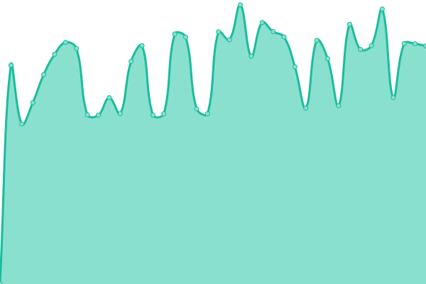

# [📈 Live Status](https://demo.upptime.js.org): <!--live status--> **🟧 Partial outage**

This repository contains the open-source uptime monitor and status page for [fridayleavework](https://demo.upptime.js.org), powered by [Upptime](https://github.com/upptime/upptime).

With [Upptime](https://upptime.js.org), you can get your own unlimited and free uptime monitor and status page, powered entirely by a GitHub repository. We use [Issues](https://github.com/fridayleavework/upptime/issues) as incident reports, [Actions](https://github.com/fridayleavework/upptime/actions) as uptime monitors, and [Pages](https://demo.upptime.js.org) for the status page.

<!--start: status pages-->
<!-- This summary is generated by Upptime (https://github.com/upptime/upptime) -->
<!-- Do not edit this manually, your changes will be overwritten -->
<!-- prettier-ignore -->
| URL | Status | History | Response Time | Uptime |
| --- | ------ | ------- | ------------- | ------ |
|  S | 🟩 Up | [s.yml](https://github.com/fridayleavework/uptime/commits/HEAD/history/s.yml) | 

 2338ms
     
 | 

<a href="https://fridayleavework.github.io/uptime/history/s">99.22%</a>
    

|  A | 🟩 Up | [a.yml](https://github.com/fridayleavework/uptime/commits/HEAD/history/a.yml) | 

 1903ms
     
 | 

<a href="https://fridayleavework.github.io/uptime/history/a">99.24%</a>
    

|  J | 🟩 Up | [j.yml](https://github.com/fridayleavework/uptime/commits/HEAD/history/j.yml) | 

 2289ms
     
 | 

<a href="https://fridayleavework.github.io/uptime/history/j">99.25%</a>
    

|  E | 🟥 Down | [e.yml](https://github.com/fridayleavework/uptime/commits/HEAD/history/e.yml) | 

 0ms
     
 | 

<a href="https://fridayleavework.github.io/uptime/history/e">100.00%</a>
    

|  [test](https://test.test.test) | 🟥 Down | [test.yml](https://github.com/fridayleavework/uptime/commits/HEAD/history/test.yml) | 

 0ms
     
 | 

<a href="https://fridayleavework.github.io/uptime/history/test">100.00%</a>
    

<!--end: status pages-->

[**Visit our status website →**](https://demo.upptime.js.org)

## 📄 License

- Powered by: [Upptime](https://github.com/upptime/upptime)
- Code: [MIT](./LICENSE) © [fridayleavework](https://demo.upptime.js.org)
- Data in the `./history` directory: [Open Database License](https://opendatacommons.org/licenses/odbl/1-0/)
